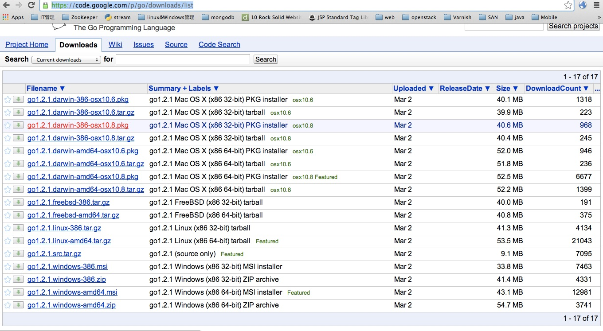

# GameStack文档
## 准备环境(Go,Lua)
### Mac安装

####  Go的安装包的选择
1.  确定系统版本

    ```bash
    uname  -m
    ```
    > 目前目前Go支持两个版本, i386(i686)/ x86_64, 一般情况下你会得到以上三个选项中的一个(如果你是PowerPC,恭喜你中奖,Go目前不支持,估计以后也不会支持)
    
2.  下载

    https://code.google.com/p/go/downloads/list
    
    
    
3.  安装Go

    基于pkg的安装,双击pkg文件,根据向导完成安装
    基于tar.gz的安装:
    
    ```bash
    cd ~/Downloads
    curl -O https://go.googlecode.com/files/go1.2.1.darwin-amd64-osx10.8.tar.gz
    tar xf go1.2.1.darwin-amd64-osx10.8.tar.gz
    
    ```
